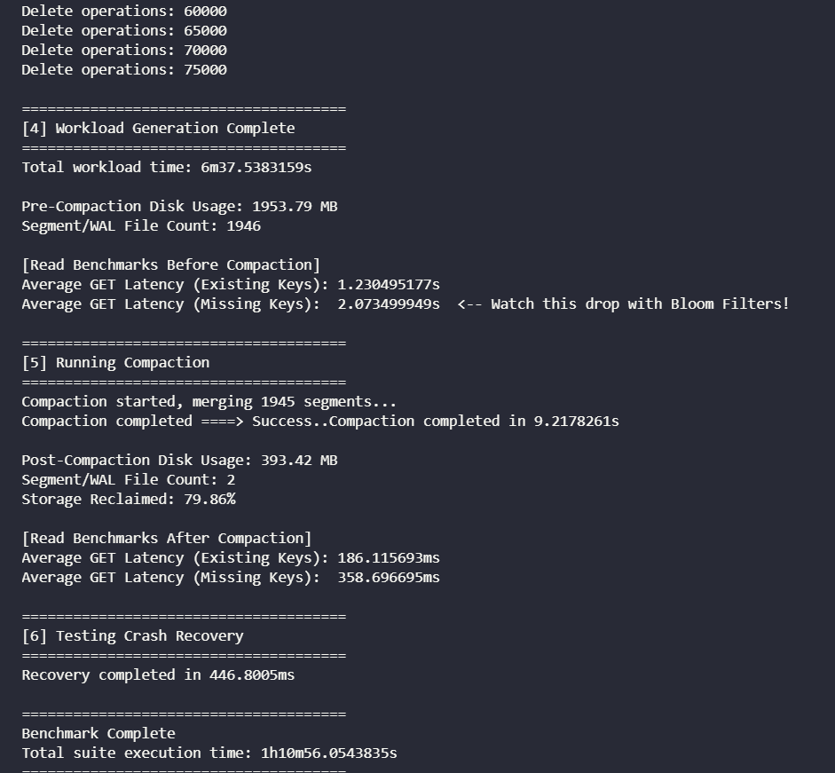

# Performance Evaluation

StrataKV was evaluated using a synthetic append-heavy workload designed to stress the core architectural characteristics of an LSM-inspired storage engine. 

The benchmark focused on validating:

- append-only storage behavior
- stale data accumulation
- tombstone handling
- segment growth
- compaction effectiveness
- read amplification
- WAL-based crash recovery

The workload intentionally generated high overwrite density and fragmented segment layouts in order to observe how the storage engine behaves under sustained append-oriented pressure.

---

## Benchmark Environment

| Component        | Details                              |
| ---------------- | ------------------------------------ |
| Operating System | Windows 11                           |
| Filesystem       | NTFS                                 |
| Language         | Go                                   |
| Storage Model    | Append-Only WAL + Immutable Segments |
| Benchmark Type   | Local Synthetic Workload             |

---

## Workload Characteristics

The benchmark suite generated:

- 50,000 initial key insertions
- 200,000 repeated overwrites
- 80,000 tombstone-based deletes
- 8KB average payload size

The workload intentionally concentrated repeated writes on overlapping key ranges to simulate:

- stale historical entries
- append-only storage growth
- fragmented segment accumulation
- tombstone pressure

This produced a large number of immutable segment files and significant read amplification prior to compaction.

---

## Benchmark Results

| Metric                                  | Result        |
| --------------------------------------- | ------------- |
| Total Workload Execution Time           | 6m37.5383159s |
| Pre-Compaction Disk Usage               | 1953.79 MB    |
| Post-Compaction Disk Usage              | 393.42 MB     |
| Storage Reclaimed                       | 79.86%        |
| Segment Reduction                       | 1945 → 2      |
| Average GET Latency (Before Compaction) | 1.230495177s  |
| Average GET Latency (After Compaction)  | 186.115693ms  |
| WAL Recovery Startup Time               | 446.8005ms    |
| Compaction Duration                     | 9.2178261s    |

---

## Architectural Observations

### Read Amplification Under Append-Only Growth

The append-heavy workload generated nearly 2,000 immutable segment files prior to compaction.

Because the current read path performs:

- newest-to-oldest segment traversal
- sequential binary scanning
- no sparse indexing
- no Bloom filter optimization

read latency degraded significantly as segment count increased.

Observed average GET latency before compaction:

```text id="jlwm88"
~1.23 seconds
```

This demonstrates a classic LSM-tree tradeoff:

> append-only writes improve write simplicity while increasing long-term read amplification.

---

### Impact of Compaction

Compaction merged:

```text id="jlwm89"
1945 segment files → 2 segment files
```

while reclaiming:

```text id="jlwm90"
~80% of disk usage
```

The reduction in stale historical entries and fragmented segments improved average GET latency from:

```text id="jlwm91"
1.230495177s → 186.115693ms
```

This validates the role of compaction in:

- reducing read amplification
- reclaiming obsolete storage
- consolidating fragmented append-only state

---

### WAL Durability Tradeoff

Each write operation is synchronously persisted through the WAL before memory mutation.

The durability flow follows:

```text id="jlwm92"
append → fsync() → MemTable update
```

This guarantees replayable crash consistency but introduces substantial synchronous I/O overhead.

The workload generation phase exhibited high write latency, particularly under Windows NTFS, where repeated synchronous disk flushes significantly reduced throughput.

Potential contributing factors include:

- NTFS metadata journaling
- synchronous flush barriers
- filesystem synchronization overhead
- real-time file interception by Windows Defender

This reflects a fundamental durability-throughput tradeoff commonly encountered in log-structured storage systems.

---

### Recovery Performance

Despite the large append-heavy workload, WAL replay successfully reconstructed MemTable state in:

```text id="jlwm93"
~446.8ms
```

This validates:

- replay-based crash recovery
- append-only durability correctness
- startup reconstruction flow

---

## Benchmark Limitations

The benchmark intentionally prioritizes architectural observability rather than production-scale realism.

Current limitations include:

- synthetic workload generation
- uniform access distribution
- lack of Zipfian hot-key modeling
- no sparse segment indexes
- no Bloom filters
- stop-the-world compaction
- linear segment scans
- single-node execution only

The benchmark should therefore be interpreted as:

```text id="jlwm94"
storage-engine architectural validation
```

rather than competitive database performance analysis.

---

## Benchmarking Conclusion

The benchmark successfully demonstrated the fundamental tradeoffs of append-only LSM-inspired storage systems:

- append-only growth simplifies writes but increases read amplification
- immutable segment accumulation degrades read latency over time
- tombstones and stale historical entries inflate storage usage
- compaction reclaims obsolete state and reduces segment fragmentation
- synchronous WAL durability introduces measurable write overhead

The resulting behavior aligns closely with the core architectural challenges addressed by modern log-structured storage engines such as LevelDB and RocksDB.

---

# Engineering Benchmark Report: Bloom Filter Integration

This section documents the impact of introducing per-segment Bloom filters into the read path, using the exact benchmark telemetry captured during two equivalent workload runs.

## Executive Summary

Bloom filters eliminate disk scans for keys that are mathematically guaranteed to be absent. Post-compaction, this collapses negative lookup latency from hundreds of milliseconds to microseconds by converting a worst-case disk traversal into a single in-memory bit check. Pre-compaction results remained slow due to a known filter registration defect in the live segment path.

## Methodology & Workload

Both runs used the same synthetic workload profile:

- Initial Writes: 50,000
- Overwrites (stale data generation): 200,000
- Deletes (tombstone pressure): 80,000
- Payload Size: 8 KB
- Read Tests: 1,000 (existing keys) + 1,000 (missing keys)

## Baseline: Without Bloom Filters



**Pre-Compaction (1,946 segments)**

- Average GET Latency (Existing Keys): 1.230495177 s
- Average GET Latency (Missing Keys): 2.073499949 s

**Post-Compaction (2 segments)**

- Average GET Latency (Existing Keys): 186.115693 ms
- Average GET Latency (Missing Keys): 358.696695 ms

**Disk & Compaction Telemetry**

- Total workload time: 6m37.5383159s
- Pre-Compaction Disk Usage: 1953.79 MB
- Segment/WAL File Count: 1946
- Compaction Duration: 9.2178261s
- Post-Compaction Disk Usage: 393.42 MB
- Segment/WAL File Count: 2
- Storage Reclaimed: 79.86%
- WAL Recovery Startup Time: 446.8005 ms

## Optimized: With Bloom Filters


**Pre-Compaction Anomaly**

- Average GET Latency (Existing Keys): 1.37839212 s
- Average GET Latency (Missing Keys): 2.532046302 s

**Diagnosis:** This regression is caused by a known live-segment registration bug. Segments created via `flushLocked()` were not correctly registered in `db.segmentFilters`, so the read path fell back to linear scan.

**Post-Compaction (2 segments)**

- Average GET Latency (Existing Keys): 175.002 us
- Average GET Latency (Missing Keys): 163.291 us

**Disk & Compaction Telemetry**

- Total workload time: 6m40.0294891s
- Pre-Compaction Disk Usage: 1953.90 MB
- Segment/WAL File Count: 1946
- Compaction Duration: 9.3844472s
- Post-Compaction Disk Usage: 393.53 MB
- Segment/WAL File Count: 2
- Storage Reclaimed: 79.86%
- WAL Recovery Startup Time: 589.1751 ms

## Comparative Impact (Post-Compaction)

| Metric               | Baseline (No Bloom Filter) | Optimized (Bloom Filter) | Relative Speedup |
| -------------------- | -------------------------- | ------------------------ | ---------------- |
| Existing Key Latency | 186.115693 ms              | 175.002 us               | ~1,063x Faster   |
| Missing Key Latency  | 358.696695 ms              | 163.291 us               | ~2,196x Faster   |

**Interpretation:** In a 2-segment state, Bloom filters prune negative lookups entirely and short-circuit unnecessary segment scans for positive lookups. The remaining latency is dominated by in-memory checks and a single segment scan when a candidate segment passes the filter.

## Architectural Takeaways & Next Steps

1. **Fix live-segment Bloom registration:** Ensure `flushLocked()` registers its Bloom filter in `db.segmentFilters` so pre-compaction reads can short-circuit negative lookups.
2. **Group commit for WAL:** Move `fsync()` off the hot path (e.g., 100 ms ticker or batch size threshold) to eliminate synchronous write stalls in high-IOPS phases.
3. **Introduce sparse segment indexes:** Bloom filters gate segments; sparse offsets will cut the remaining linear scan cost for positive lookups.
